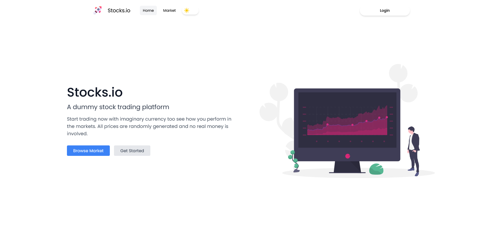
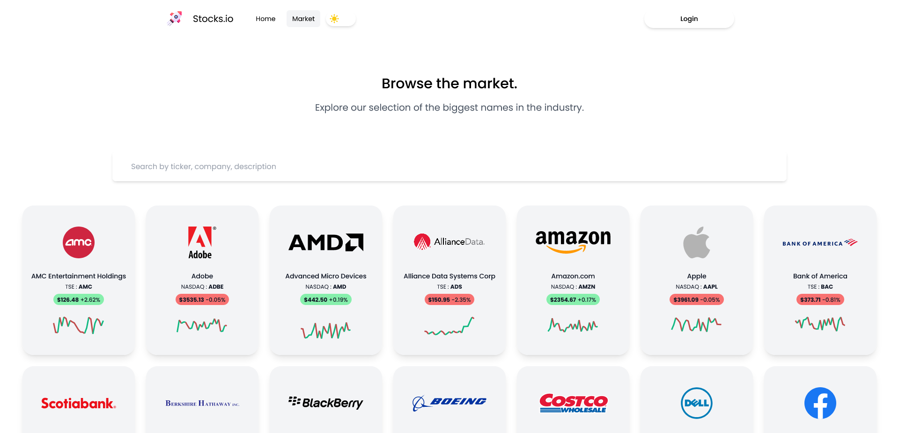
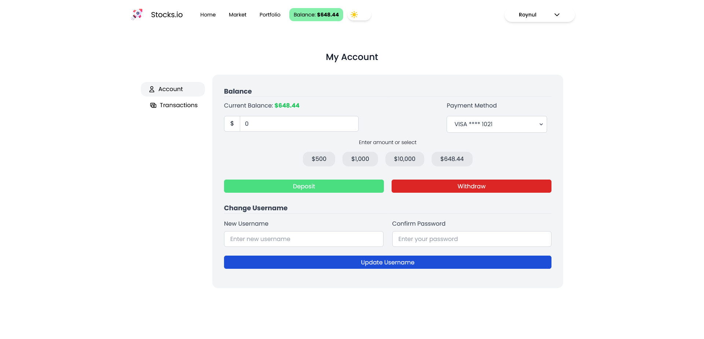
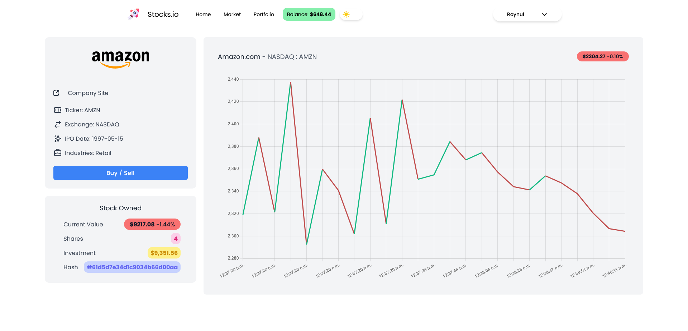

# 📈 Stocks.io - Stock Brokerage Platform Clone

A modern full-stack stock trading platform inspired by **Zerodha**, built using the MERN stack with GraphQL and real-time market data.  

Users can view real-time stock prices, buy/sell stocks, manage portfolios, and track transactions — all within an elegant, responsive UI.

---

## 🚀 Features

- 🔐 **User Authentication** – Secure login & signup
- 📊 **Real-Time Stock Prices** – Live market data with WebSockets
- 💼 **Portfolio Management** – View owned stocks, values, and changes
- 💸 **Buy & Sell Stocks** – Seamless transaction execution
- 📈 **Dynamic Price Charts** – Track performance of individual stocks
- 🌗 **Dark Mode** toggle
- 📱 **Responsive UI** for desktop and mobile

---

## 🛠️ Tech Stack

### Frontend
- **React.js + TypeScript**
- **Tailwind CSS** – Modern styling
- **Redux Toolkit** – State management
- **GraphQL Codegen** – Auto-generates queries & mutations
- **Vite** – Lightning-fast bundler

### Backend
- **Node.js + Express.js**
- **TypeScript**
- **GraphQL (Apollo Server)**
- **MongoDB + Mongoose** – NoSQL DB for storing users, stocks, and transactions
- **JWT Authentication**
- **Socket.IO** – For live stock price updates

---

## 🖼️ Screenshots

### 🏠 Home Page


### 📈 Market Page


### 💰 Portfolio Page


### 📄 Stock Details Page


---

## 📂 Folder Structure

Stocks.io/
├── client/ # React frontend
│ ├── src/
│ ├── public/
│ ├── components/
│ └── pages/
├── server/ # Node.js + GraphQL backend
│ ├── models/
│ ├── graphql/
│ └── sockets/
├── misc/ # Screenshots
├── docker-compose.yml
└── README.md

yaml
Copy
Edit


---

## ⚙️ Local Setup Instructions

### 1. Clone the Repo

```bash
git clone https://github.com/Rishabh80330/Stocks.io.git
cd Stocks.io

2. Install Client Dependencies
cd client
npm install
3. Install Server Dependencies
bash
Copy
Edit
cd ../server
npm install
4. Start the Development Servers
Frontend (Client)

bash
Copy
Edit
cd ../client
npm run dev
Backend (Server)

bash
Copy
Edit
cd ../server
npm run start
🌐 Live Demo
(Coming soon — can be deployed on Vercel or Render)

📜 License
This project is licensed under the MIT License.

🙋‍♂️ Author
Rishabh Agrawal
🔗 LinkedIn
📧 Email

yaml
Copy
Edit

---

### ✅ To Use:
1. Copy the content into your project’s `README.md` file.
2. Replace `"your.email@example.com"` if you want to add your email.
3. Once saved, `git add README.md`, commit, and push it:

```bash
git add README.md
git commit -m "Add professional README"
git push origin main
